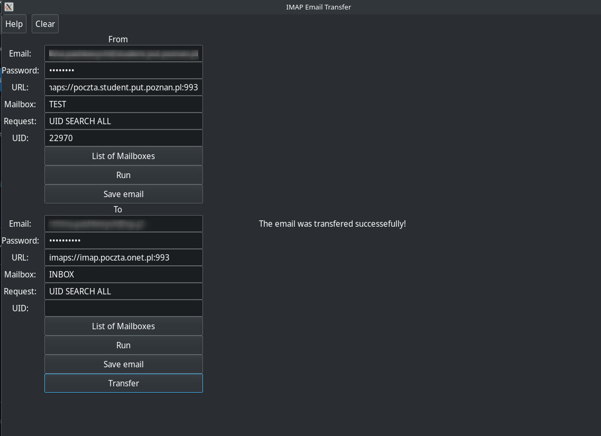

# IMAP Email Transfer Application

## Overview
The IMAP Email Transfer application is a GUI-based tool designed to manage emails over IMAP using the libcurl library. It allows users to perform operations such as listing mailboxes, running custom IMAP commands, saving emails, and transferring emails between different IMAP servers.



## Compilation
To compile the application, ensure that the `gtk4` and `libcurl` libraries are installed on your system. Use the following command to compile:

```bash
gcc `pkg-config --cflags --libs gtk4` -o imap imap-email-transfer.c -lcurl
```

## Usage
Run the compiled application by executing:

```bash
./imap
```

## Features
- **List Mailboxes**: Retrieve and display the list of all mailboxes from the server.
- **Run IMAP Commands**: Execute custom IMAP commands to interact with the email server.
- **Save Emails**: Save selected emails from your inbox.
- **Transfer Emails**: Transfer emails between two specified IMAP servers.

## Functionality
The application utilizes a structure named `EmailServerDetails` to store user inputs such as email, password, URL, mailbox details, and other IMAP command requests. The GUI is built using GTK, which includes entry fields and buttons to trigger specific actions.

### Key Functions:
- `on_list_mailboxes_clicked()`: Lists all mailboxes from the server.
- `on_run_clicked()`: Runs the specified IMAP command.
- `on_save_clicked()`: Saves the specified email.
- `on_transfer_clicked()`: Transfers emails from one server to another.

## Dependencies
- **GTK4**: Used for creating the graphical user interface.
- **libcurl**: Used for handling the IMAP protocol to send and receive emails.

## System Requirements
- Linux OS with development tools installed.
- GTK4 and libcurl libraries.

## Additional Documentation Files

- **index.html**: The main HTML file for the application's web-based documentation.
- **style.css**: Contains the CSS styles used for styling the documentation's HTML content.
- **script.js**: JavaScript file used to handle interactive behaviors in the web documentation.

